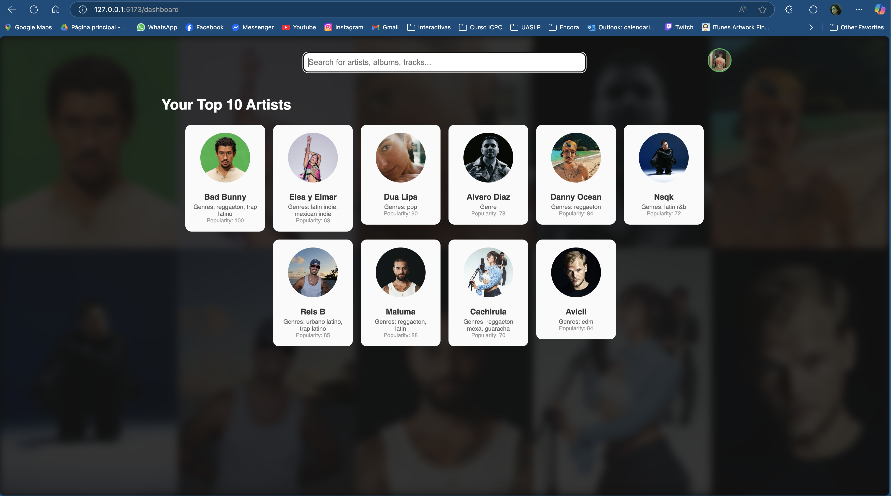

# 🎵 Breakable Toy 2 - Spotify Stats Web App

Una aplicación web full stack que se integra con la API de Spotify para mostrar estadísticas personalizadas del usuario, incluyendo sus artistas principales, álbumes, pistas, y permite búsquedas en todo el catálogo de Spotify.

---

## 📸 Vista previa

<!-- Si tienes imágenes de la app, agrega aquí una captura de pantalla -->


---

## 🚀 Funcionalidades

- ✅ Autenticación OAuth 2.0 con Spotify
- 🎧 Visualización de los 10 artistas principales
- 🔍 Vista detallada de artistas, álbumes y canciones
- 🧠 Búsqueda de artistas, álbumes, pistas y playlists
- ▶️ Reproductor embebido de previews
- 🔐 Sesión persistente mediante cookies HttpOnly
- 🔁 Refresh automático del token de acceso sin intervención del usuario

---

## 🛠️ Tecnologías utilizadas

### Backend
- Java 21
- Spring Boot
- Gradle
- Spotify Web API
- OAuth 2.0
- JUnit + Mockito

### Frontend
- React + TypeScript
- Vite
- React Router
- Tailwind CSS
- Jest + React Testing Library

---

## 🧪 Requisitos

### Prerrequisitos

- Node.js y npm
- Java 21
- Spotify Developer Account
- (Opcional) Docker

### Variables necesarias

1. Crea una aplicación en el [Spotify Developer Dashboard](https://developer.spotify.com/dashboard).
2. Obtén tu `client_id` y `client_secret`.
3. Registra el siguiente redirect URI:

```
http://127.0.0.1:8080/auth/spotify/callback
```

---

# 📦 Instalación y ejecución

Sigue estos pasos para ejecutar el proyecto localmente en tu máquina.

---

## 1. Clonar el repositorio

```bash
git clone https://github.com/tu-usuario/BreakableToy2.git
cd BreakableToy2
```

---

## 2. Configura el backend

Modifica el archivo `src/main/resources/application.properties.example` eliminando el `.example` y agrega tus valores (no se sube a Git):

```properties
spotify.client-id=${SPOTIFY_CLIENT_ID}
spotify.client-secret=${SPOTIFY_CLIENT_SECRET}
spotify.redirect-uri=http://127.0.0.1:8080/auth/spotify/callback
```

```bash
cd bt2-backend
```

Inicia el servidor backend:

```bash
./gradlew bootRun
```

---

## 3. Configurar el frontend

Crea un archivo `.env` en la raíz de `bt2-frontend` con esta línea:

```env
VITE_API_URL=http://127.0.0.1:9090
```
Ejecuta el proyecto con:

```bash
cd ../bt2-frontend
npm install
npm run dev
```

Accede a la aplicación en: [http://127.0.0.1:9090](http://127.0.0.1:9090)

---

## 🔐 Autenticación y sesión

- Al iniciar sesión, se guarda el `access_token` y `refresh_token` en cookies `HttpOnly`.
- Si el `access_token` expira, el backend lo refresca automáticamente con el `refresh_token` (válido por 7 días).
- La sesión se mantiene activa incluso al cerrar y reabrir la pestaña.

---

## 🧾 Estructura del proyecto

```
BreakableToy2/
├── bt2-backend/         # Backend en Spring Boot
│   ├── src/
│   └── build.gradle
├── bt2-frontend/        # Frontend en React + Vite
│   ├── src/
│   └── vite.config.ts
├── README.md
```

---

## 👤 Autor

**Tadeo Lozano**
